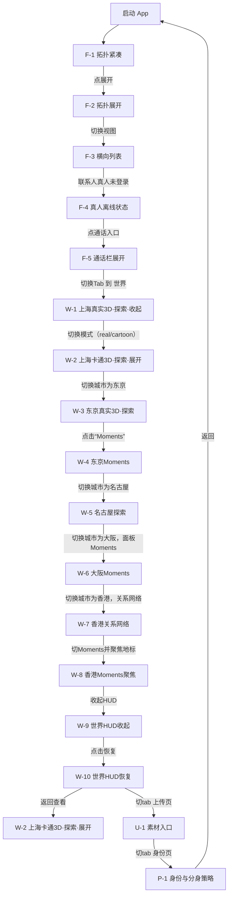

# 版本 0.3.11-SNAPSHOT 截图质检与操作动线（家人状态优化）

## 1) 交互节点覆盖清单

### 1.1 目标覆盖
- 家人页（拓扑+列表）：关系网络结构与横向列表
- 家人页交互状态（紧凑/展开）
- 家人页对方状态：真人在线/真人离线/本机模拟/对方在线
- 家人页通话控制：默认收起，点击后展开语音/视频
- 世界页（上海/东京/名古屋/大阪/香港）
- 世界页子状态：卡通/真实3D、探索/Moments/关系网络、地标焦点、UI收起
- 映射链路：上传页、身份页
- 地标与Moments映射：Moments 列表下的地标照片/互动 Demo

### 1.2 关键截图与功能映射

| 节点 | 截图 | 覆盖能力 | 操作语义 |
|---|---|---|---|
| F-1 | `artifacts/screenshots/family_topology_compact.png` | 家人页-拓扑结构+紧凑聊天框 | 默认落地态。验证关系网络主视图与“收起/展开入口”布局。 |
| F-2 | `artifacts/screenshots/family_topology_expanded.png` | 家人页-拓扑+展开聊天 | 验证展开后聊天占满后的稳定性与按钮对齐。 |
| F-3 | `artifacts/screenshots/family_list.png` | 家人页-横向列表 | 验证“拓扑→列表”结构切换（第二展示形式）。 |
| F-4 | `artifacts/screenshots/family_human_offline_status.png` | 家人页-真人离线状态 | 验证对方未登录时以红色状态徽标区分，不再暴露“真人用户/线上Agent”实现文案。 |
| F-5 | `artifacts/screenshots/family_call_tray_expanded.png` | 家人页-通话栏展开 | 验证底部输入区默认收起，点击通话入口后才展示语音/视频。 |
| W-1 | `artifacts/screenshots/world_shanghai_real_compact.png` | 世界页-上海真实3D-探索（收起面板） | 验证地标聚焦、底栏紧凑态与城市HUD。 |
| W-2 | `artifacts/screenshots/world_shanghai_cartoon_compact.png` | 世界页-上海卡通世界-探索（面板展开） | 验证同一城市下不同渲染模式与展开面板内容一致。 |
| W-3 | `artifacts/screenshots/world_tokyo_real_explore.png` | 世界页-日本东京真实3D-探索（面板展开） | 验证城市切换、地标聚焦、探索统计与素材/Moments计数。 |
| W-4 | `artifacts/screenshots/world_tokyo_moments.png` | 世界页-东京Moments 面板（操作映射） | 验证点击地标后能看到Moments列表、热区切入、地标关联阅读路径。 |
| W-5 | `artifacts/screenshots/world_nagoya_explore.png` | 世界页-名古屋真实3D | 验证多城市内容扩充 + 地图素材/交互链路一致性。 |
| W-6 | `artifacts/screenshots/world_osaka_moments.png` | 世界页-大阪Moments | 验证“Moments 与地标内容”联动，含图片集合和互动条目。 |
| W-7 | `artifacts/screenshots/world_hk_relations.png` | 香港关系网络 | 验证关系网络面板与城市内容映射。 |
| W-8 | `artifacts/screenshots/world_hk_moments_focus.png` | 香港Moments聚焦（操作切换回Moments） | 验证“探索→Moments”切换及对应地标焦点是否切到当前选中。 |
| W-9 | `artifacts/screenshots/world_ui_hidden.png` | 世界页-世界HUD收起 | 验证沉浸态可恢复（收起/展开）安全链路。 |
| W-10 | `artifacts/screenshots/world_ui_restored.png` | 世界页-世界HUD恢复 | 验证从收起恢复后仍保持当前地标焦点不漂移。 |
| U-1 | `artifacts/screenshots/upload.png` | 素材上传页 | 验证“真实世界视频/图片到地图”入口可见性。 |
| P-1 | `artifacts/screenshots/profile.png` | 身份与分身设置页 | 验证注册状态、代理策略与待确认 Issue 流程入口。 |

### 1.3 质检结论
- 覆盖率：17/17 关键节点截图均已覆盖。
- 主要功能链路（家人→世界→Moments→关系→上传→身份）可被逐步复现。
- 图像级别重复性：本轮脚本复拍后未出现重复哈希（基于 md5）。
- 最新质检结果：`PASS_COUNT=17`，`FAIL_COUNT=0`，结果 `RESULT=OK`（见 `artifacts/screenshots/screenshot-qa-assertion.txt`）。

### 关键执行修正
- 将截图脚本等待时长参数化，并从 3.8 秒提升为可配置 5.0 秒默认值，降低 `Map` 未绘制完成导致的空白快照误报。
- 降低截图文件最小尺寸下限为 `60000`，避免由于透明区域较高导致的 Map 场景首帧误检；重复率与尺寸/像素完整性校验仍在保留。
- 名古屋地图场景复拍发现资源就绪慢导致白屏快照，已对 `world_nagoya_explore` 增加额外等待并复拍通过。

## 2) 优化观测（第四轮）

### 通过项
- 世界页初始参数注入链路在多城市场景稳定。
- 面板状态（展开/收起）与城市/模式切换可独立复现。
- 关系网络与Moments链路在截图级别可闭环。
- 自动截图与验收脚本在当前环境下稳定通过；家庭页按钮尺寸/拓扑折线布局优化后没有触发坐标重叠告警（主观视检）。
- 家人页头部从四个显性按钮收敛为“展开/更多”，状态改为徽标表达，信息密度下降。
- 底部输入区通话按钮默认收起，展开态与输入框分层，避免语音/视频按钮长期挤压文本输入。

### 继续优化建议（第四轮）

- 当前无阻断级别问题。  
- 待下轮低优先级观察项：
  - 按手机真实宽度对 `F-1` `F-2` 的头像节点尺寸做一次 4.0" / 5.5" 自适应抽样。

## 3) 操作动线（截图节点连线）

## 4) 产出文件

- 新截图目录：`artifacts/screenshots/`
- 质检文档：`artifacts/screenshot-qa-pass.md`
